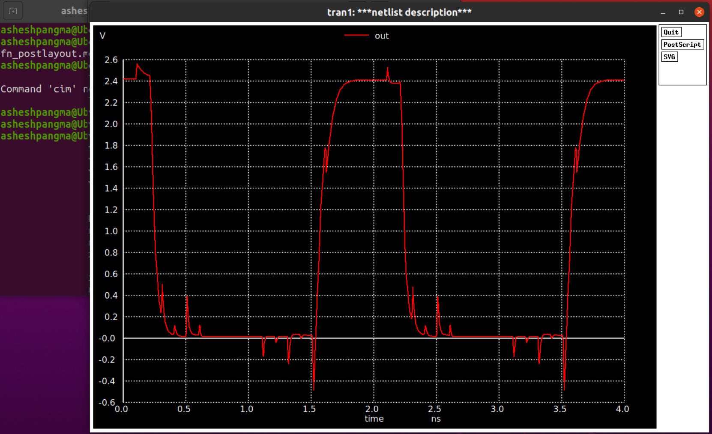
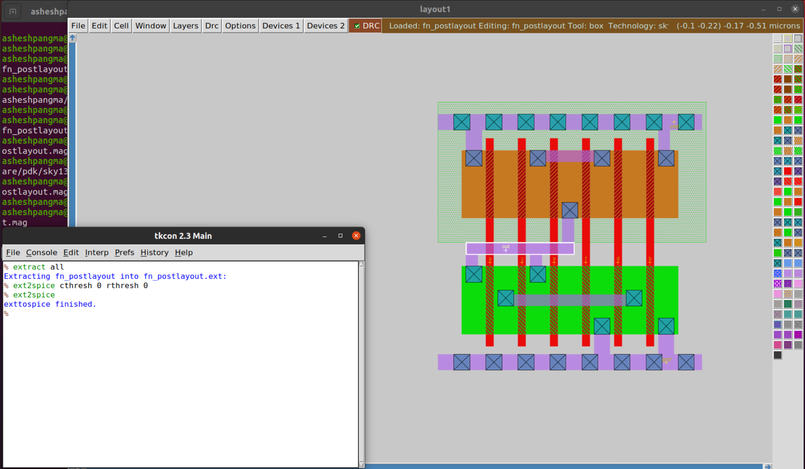
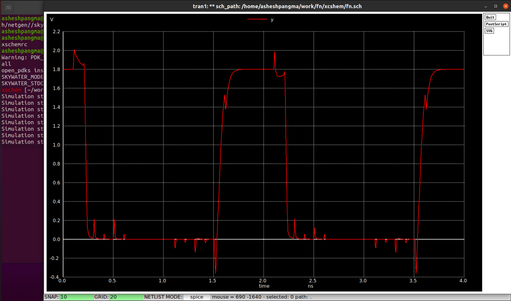
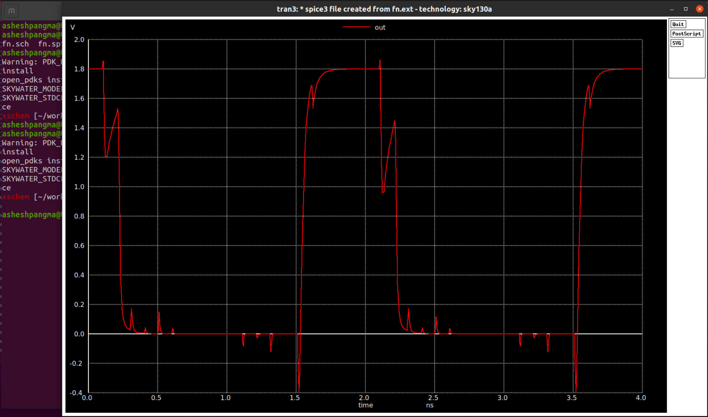
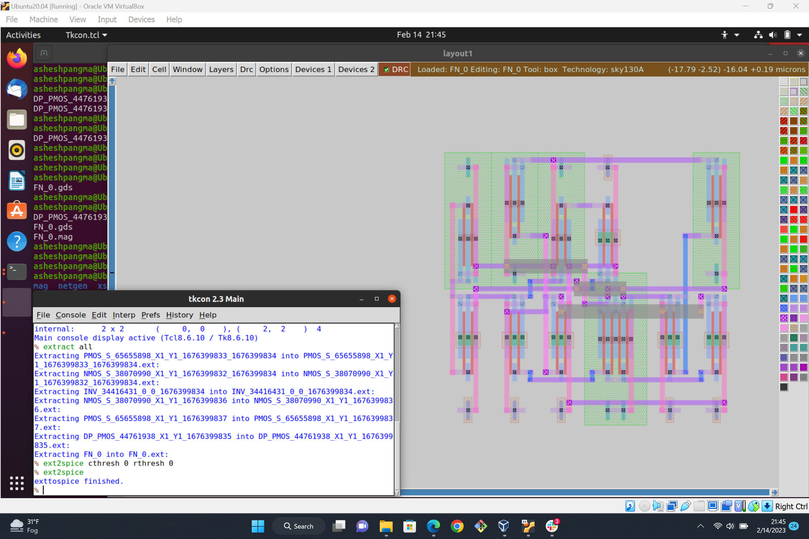
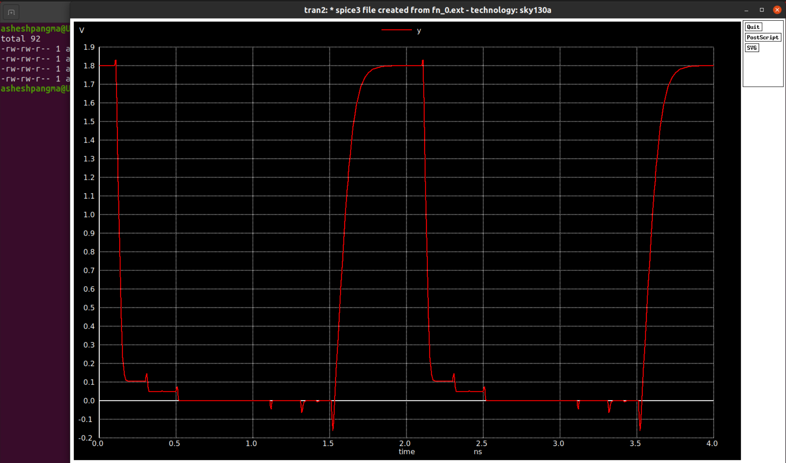

# msvsdaa

# WEEK-0


To install xschem:
```
$  git clone https://github.com/StefanSchippers/xschem.git xschem_git
$	./configure
$  make
$  sudo make install
```
To install magic:
```
$  git clone git://opencircuitdesign.com/magic
$  cd magic
$	 ./configure
$  make
$  sudo make install
```

To install Sky130 pdk:

```
$  git clone git://opencircuitdesign.com/open_pdks
$  open_pdks
$	./configure --enable-sky130-pdk
$  make
$  sudo make install
```

To install ALIGN:
```
export CC=/usr/bin/gcc
export CXX=/usr/bin/g++
git clone https://github.com/ALIGN-analoglayout/ALIGN-public
cd ALIGN-public

#Create a Python virtualenv
python -m venv general
source general/bin/activate
python -m pip install pip --upgrade

# Install ALIGN as a USER
pip install -v .

# Install ALIGN as a DEVELOPER
pip install -e .

pip install setuptools wheel pybind11 scikit-build cmake ninja
pip install -v -e .[test] --no-build-isolation
pip install -v --no-build-isolation -e . --no-deps --install-option='-DBUILD_TESTING=ON'
```
To make ALIGN portable to sky130 pdk:
```
$git clone https://github.com/ALIGN-analoglayout/ALIGN-pdk-sky130
```


To check if the installation is correct:
```
mkdir inverter
$ cd inverter
$ mkdir mag
$ mkdir netgen
$ mkdir xschem
$ cd xschem
$ cp /usr/local/share/pdk/sky130A/libs.tech/xschem/xschemrc .
$ cp /usr/local/share/pdk/sky130A/libs.tech/ngspice/spinit .spiceinit
$ cd ../mag
$ cp /usr/local/share/pdk/sky130A/libs.tech/magic/sky130A.magicrc .magicrc
$ cd ../netgen
$ cp /usr/local/share/pdk/sky130A/libs.tech/netgen//sky130A_setup.tcl .
```


waveform |  Values
:-------------------------:|:-------------------------:
  |  

The output reaches 50% in 389.25ns.


waveform |  Values
:-------------------------:|:-------------------------:
  |  

The output reaches 50% in 390.38ns.


waveform |  Values
:-------------------------:|:-------------------------:
  |  

The output reaches 50% in 411.97ns.

Thus, the difference delay observed when comparing pre-layout simulation with post layout simulation using magic is 1.13ns. And when compared to post layout simulation using ALIGN is 22.72ns.


## Prelayout and Postlayout simulation of a function Fn = [(B+D).(A+C)+E.F]'

The following is the spice netlist of the function:
```
***Netlist description for prelayout simulation***
M1 3 a vdd vdd pmos W=2.125u L=0.25u
M2 2 b vdd vdd pmos W=2.125u L=0.25u
M3 4 d 2 2 pmos W=2.125u L=0.25u
M4 4 c 3 3 pmos W=2.125u L=0.25u
M5 out e 4 4 pmos W=2.125u L=0.25u
M6 out f 4 4 pmos W=2.125u L=0.25u

M7 out a 6 6 nmos W=2.125u L=0.25u
M8 out c 6 6 nmos W=2.125u L=0.25u
M9 out e 7 7 nmos W=2.125u L=0.25u
M10 6 b 0 0 nmos W=2.125u L=0.25u
M11 6 d 0 0 nmos W=2.125u L=0.25u
M12 7 f 0 0 nmos W=2.125u L=0.25u

cload out 0 10f

Vdd vdd 0 2.5
V1 a 0 0 pulse 0 2.5 0.1n 10p 10p 1n 2n
V2 b 0 0 pulse 0 2.5 0.2n 10p 10p 1n 2n
V3 c 0 0 pulse 0 2.5 0.3n 10p 10p 1n 2n
V4 d 0 0 pulse 0 2.5 0.4n 10p 10p 1n 2n
V5 e 0 0 pulse 0 2.5 0.5n 10p 10p 1n 2n
V6 f 0 0 pulse 0 2.5 0.6n 10p 10p 1n 2n

***Simulation commands***
.op
.tran 10p 4n

*** .include model file ***
.include my_model_file.mod
.end
```

We simulate this spice netlist and obtain the following waveform.



Postlayout simulation requires us to extract a netlist from magic. The extraction process is shown by the picture below. We then obtain another spice netlist with parasitics capacitance and resistance. This increases the delay in the circuit.



# Week-1
 I first create schemetic on Xschem and made the necessary connections. A pulse input is provided to each input A, B, C, D, E, F and the output is taken from port Y.


Then the schematic is simulated using ngspice. I obtained the following waveform:



Now, I performed post-layout simulation of the function using Magic. First, the spice file for the function is imported in magic and all the parasitic in the crcuit are extracted which is shown by the screenshot below:


New spice file is generated by magic. In the new spice file, I added input pulse and simulate it using ngspice. The following waveform is obtained. 



The waveform is similar to that of pre-layout simulation. However, I observe small delay in the waveform that might be caused due to parasitics in the layout.

Now, I perform post-layout simulation using ALIGN. Here, I first ran ALIGN on the spice file generated by xschem and generated .gds and .lef file. These files can be viewed using klayout. In magic, I read the .gds file. Some DRC(Design Rule Check) errors were observed. I first removed all the DRC errors and extracted spice netlist as shown in the screenshot below.



Then, a new spice file is generated. I again provided the input pulse and simulated the spice file using ngspice. The following waveform is obtained.



### Week-1 Conclusion
In conclusion, the waveform generated while performing pre-layout simulation and post-layout simulation are not exactly the same. In post-layout simulation, parasitic capacitence and resistance are also considered whereas in pre-layout simulation, parasitics are not considered and are connected using ideal wires which is not actually the case in real.

Post-layout simulation using magic and ALIGN are also not exactly the same. ALIGN have lower parasitics effect than Magic. Thus, we observe more delay when performing post-layout simulation using Magic than ALIGN.
 


# References

* http://opencircuitdesign.com/