# msvsdaa

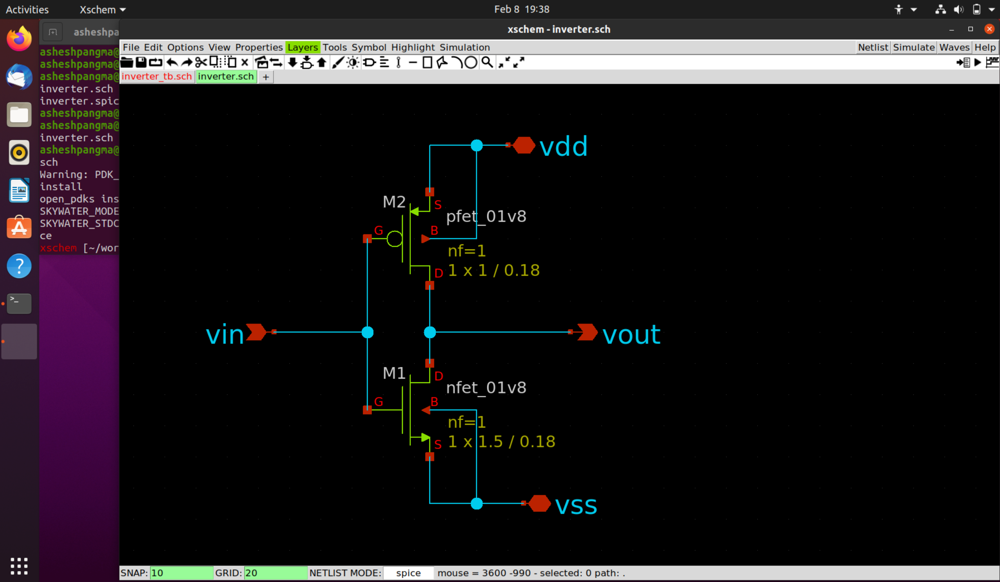

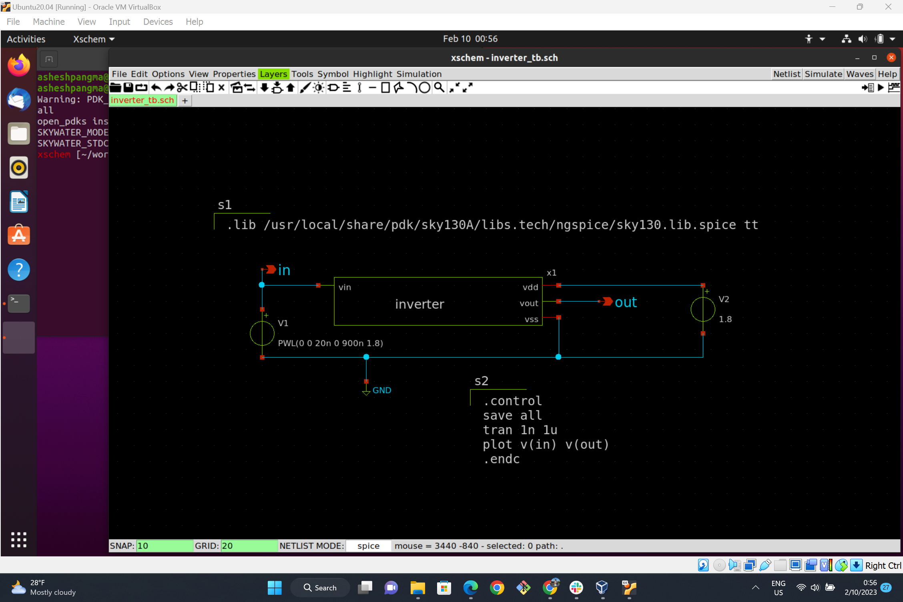

waveform |  Values
:-------------------------:|:-------------------------:
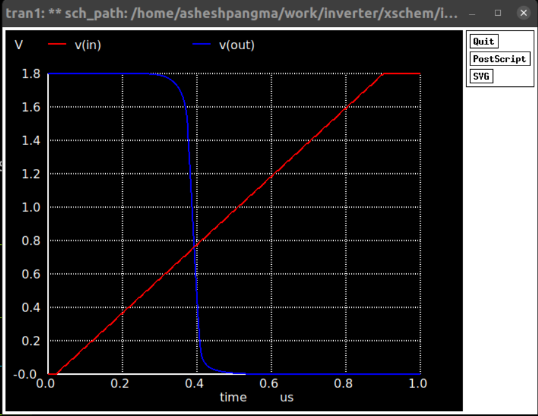  |  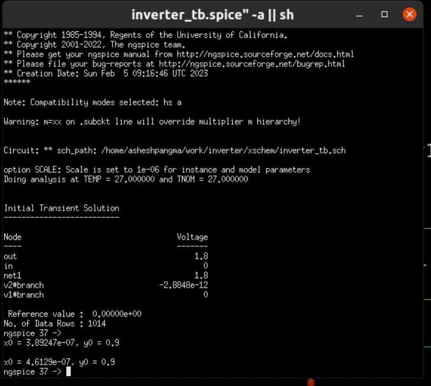

The output reaches 50% in 389.25ns.

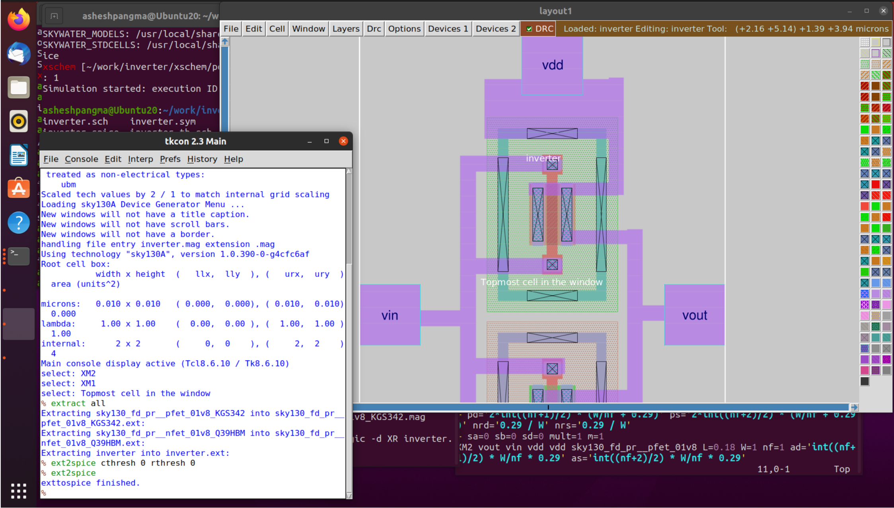

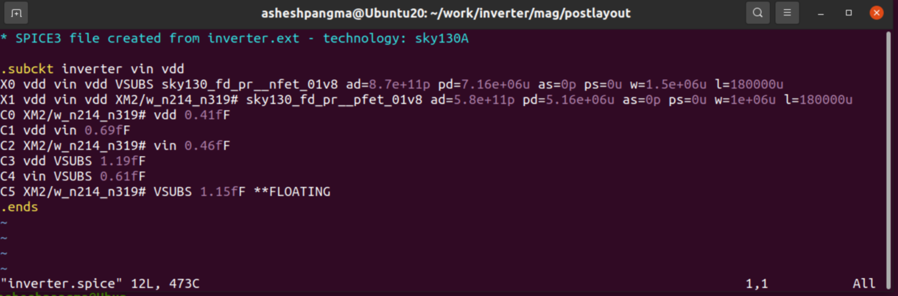

waveform |  Values
:-------------------------:|:-------------------------:
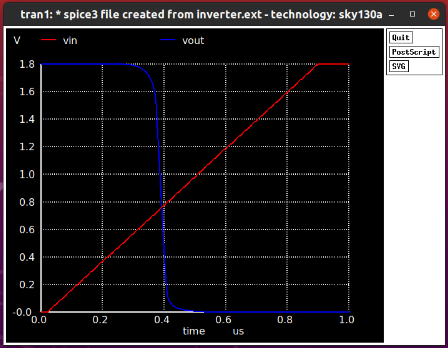  |  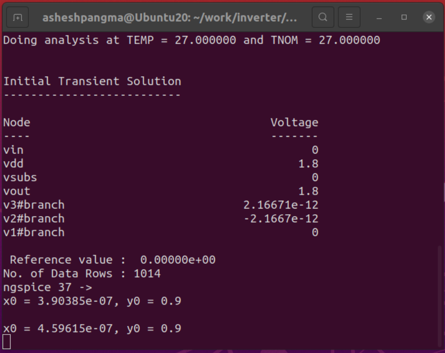

The output reaches 50% in 390.38ns.

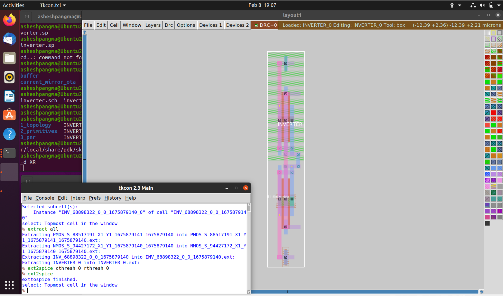

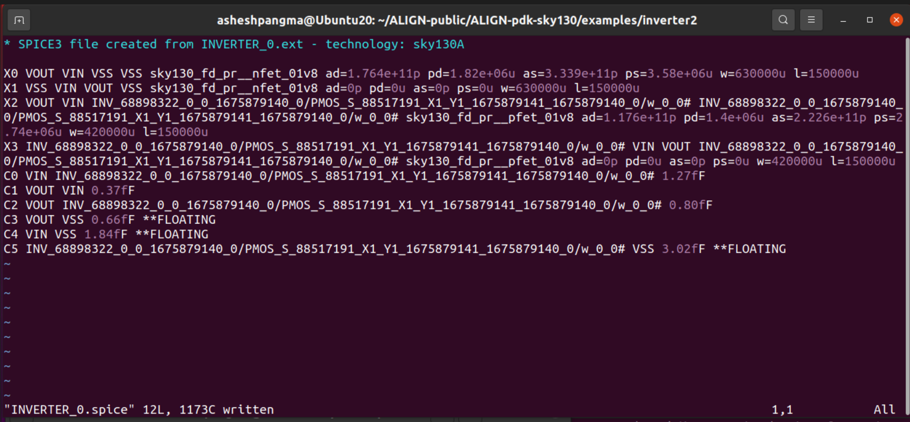

waveform |  Values
:-------------------------:|:-------------------------:
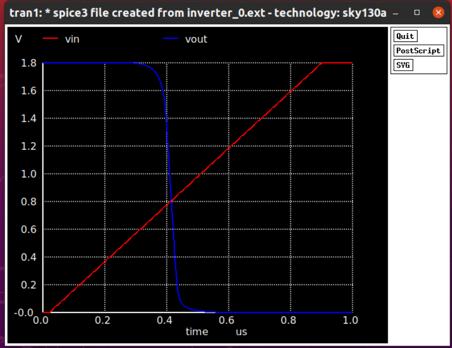  |  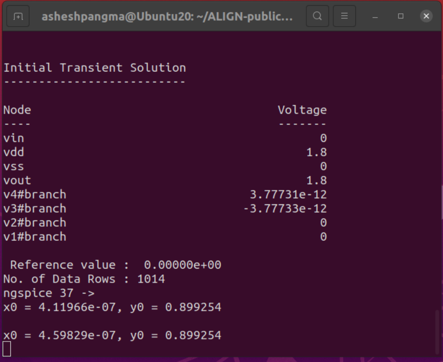

The output reaches 50% in 411.97ns.

Thus, the difference delay observed when comparing pre-layout simulation with post layout simulation using magic is 1.13ns. And when compared to post layout simulation using ALIGN is 22.72ns.
